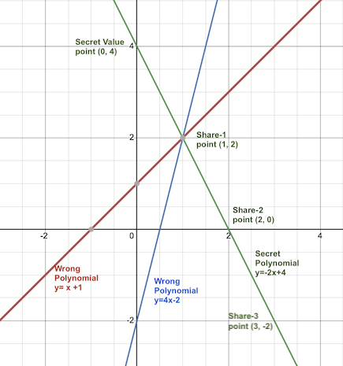

# Distributed Key Generation for Treshold Signature
We want to allow a subset $t$ of $n$ parties to perform a distributed secure computation without any party disclosing it's own secret to others.

Assuming the reader is accustomed to the word DKG, we start by exploring secret sharing, as it is at the heart of multi party computation (MPC). 

# Shamir Secret Sharing Scheme (SSSS)
SSSS allows the _split_ of a single secret among $n$ parties, such that no party alone is in possession of the whole secret. It allows the definition of a treshold $t \lt n$ such that $t + 1$ parties are required to make use of the whole secret. The secret data held by a party is called a __share__.

If a secret (e.g. private key) is made out of $n$ _distincts_ shares distributed among those parties, then $t + 1$ share holders can collaborate to make use of that secret. This is called SSSS $t$ out of $n$.

## Math
Assume we can use a secret polynomial (e.g. $y=-2x+4$) to hide the secret. The secret will be the value of the secret polynomial at a defined point (e.g $x_s=0$) and each share will be a random, distinct point on the secret polynomial. Distinct means $\forall_{i,j, i \ne j}, x_i \ne x_j \land x_i \ne x_s$.

If for example we require $2$ shares for a signature, we can encode all $n$ shares into a polynomial of degree $1$ (a line). The following picture illustrates the math behind SSSS using polynomials of degree one. The following picture displays a secret polynomial represented by the green line. The secret value is the $y$ of the secret polynomial at the point $x_s=0$. On the picture bellow, the hidden secret value $y_s=4$. 

If we give share-1 or the point $(1,2)$ to Bob, there is no way Bob can compute the secret value $y_s$ without any any additional information. This is because many other lines can cross the point $(1,2)$. Bob could for example use the wrong polynomial $y=x+1$ to guess $y_s$ at $(0,1)$ on the red line or use the wrong polynomial $y=4x+2$ to guess $y_s$ at $(0, -2)$ on the blue line. As there is an infinite number of lines going through the point $(1,2)$, Bob has no chance to compute our secret.

As soon as Alice discloses share-2 at point $(2,0)$, Bob can draw a green line that passes through $(1,2)$ and $(2,0)$, and thereby uncover the secret polynomial $y=-2x+4$ and use it to compute $y_s$ at $(0,4)$.

If we give share-3 to Paul, either Bob and Alice, Bob and Paul or Alice and Paul can use two points to trace the line describing the secret polynomial.

## Notational Desambiguation on Indexes
For the elaboration of the math behind SSSS, we will be dealing with 2 sets of numbers (resp. indexes):

### Set of Polynomial Coefficients
The set $I = \\{ 0,1, \dots, i,j,..., k-1 \\}$ is used to index coefficients of a polynomial, e.g. $f(x) = a_0 + a_1x + a_2x^2 + \dots + a_i+ \dots + a_{k-1}x^{k-1}$. 

For a pairwise comparison of those coefficients, we will use $\forall_{i,j, i \ne j}$.

This index starts with $0$ and ends with $k-1$.

### Set of Parties (resp. Secret Shares)
The set $H = \\{1,2, \dots, h,m, \dots, t, \dots, n \\}$ is used to index secret shares e.g.: $S_h$ or parties e.g.: $P_h$. Recall shares are also points on the polynomial graph e.g.: $(x_h, y_h)$ or $(x_h, f(x_h))$.

For a pairwise comparison of those elements, we will use $\forall_{h,m, h \ne m}$. 

The value $n$ is the number of parties involved in the secret sharing. The indexing starts with $1$ and ends with $n$.

The value $t$ is the treshold for the recovery of the secret. The indexing of parties involved in a recovery session starts with $1$ and ends with $t+1$.

### Polynomial Points vs. Coefficients
In summary, we address polynomial coefficients with $i, j, k$ and we address shares, which are polynomial points (resp. points coordinates), with $h, m, t, n$. No representation in this document will be using any other nomenclature.

## Computing Shares
The math behind SSSS is simpler to explain using a degree $1$ polynomial. To generalize the idea, if we need $t+1$ shares from a total of $n$ shares to recover a secret, we can hide the shares in a secret polynomial of degree $k-1 (=t)$. If for example we have a comitee of $n=7$ members and we require $4$ signatures to sign a contract, we will have to hide the secret into a $3rd$ degree polynomial $(t=k-1=3)$. Remark that $t$ and $k$ are not in the same index set.

In order to compute shares of the secret, we need to:

### Define a Secret Point
The secret $S$ is the point $(x_s, y_s)$, where $x_s\ne x_i, \forall_{i\in H}$. Generally $x_s=0$ but can also be another commonly aggreed upon $x$ coordinate. Recall that no secret share can not carry the same coordinate as $x_s$, as it would be holding the whole secret $y_s$.

### Define the Secret Polynomial 
The secret polynomial $f(x)$ is used to hide the secret point, so that $S=(x_s,f(x_s))=(x_s, y_s)$.

$f(x)$ in its coefficient form looks like:

$$f(x) = \sum_{i=0}^{k-1} a_ix^i$$

which is equivalent to

$$f(x) = a_0 + a_1x + a_2x^2 + \dots + a_{k-1}x^{k-1}$$ 

If for example $x_s=0$, then $S = f(0) = a_0$. Therefore using $x_s=0$ makes it easy to generate the secret polynomial $f(x)$.

This secret polynomial can be defined by randomly selecting $a_1, \dots, a_{k-1}$ from a [finate field](./ecgroups.md#modular-arithmetic) $\mathbb{F_{(p^n)}}$. E.g.: for $a_1=-5, a_2=-4, a_3=1$ the following polynomial $f(x)=9 -5x -4x^{2}+ x^{3}$ can be used to hide the secret value $S=9$.

### Compute Individual Secret Shares
After defining the polynomial $f(x)=x^{3} - 4x^{2}  - 5x + 9$, we select for each party $P_h, h \in \\{1, \dots, 7\\}$ a random $x_h$, compute the secret share $S_h=y_h=f(x_h)$ and finaly return the secret share $(x_h, S_h)$ to party $P_h$. The following picture displays the graph, the points holding each of the $7$ secret shares and the secret point $S=(0,9)$.

## Lagrange Interpolation
Using the lagrange interpoalation, we can compute any other point when we are in possession of $t$ points.

The generalized lagrange formula for the recovery of a point is:

$$
f(x) = \sum_{h=1}^{t+1}y_hl_h(x)
$$

where 

$$
l_h(x) = \prod_{m=1, m \ne h}^{t+1} \frac{x - x_m}{x_h-x_m}
$$

In our example, knowing $4$ of the points above $\{(-2,-5), (-1,9), (2,-9), (3, -15)\}$, we can compute the point at $x=4$:

$$
\begin{aligned}
l_1(4) &= \frac{4-x_2}{x_1-x_2} \times \frac{4-x_3}{x_1-x_3} \times \frac{4-x_4}{x_1-x_4} = \frac{4+1}{-2+1} \times \frac{4-2}{-2-2} \times \frac{4-3}{-2-3} = \frac{5}{-1} \times \frac{2}{-4} \times \frac{1}{-5}=\frac{-1}{2}
\\
l_2(4) &= \frac{4-x_1}{x_2-x_1} \times \frac{4-x_3}{x_2-x_3} \times \frac{4-x_4}{x_2-x_4} = \frac{4+2}{-1+2} \times \frac{4-2}{-1-2} \times \frac{4-3}{-1-3} = \frac{6}{1} \times \frac{2}{-3} \times \frac{1}{-4}=1
\\
l_3(4) &= \frac{4-x_1}{x_3-x_1} \times \frac{4-x_2}{x_3-x_2} \times \frac{4-x_4}{x_3-x_4} = \frac{4+2}{2+2} \times \frac{4+1}{2+1} \times \frac{4-3}{2-3} = \frac{6}{4} \times \frac{5}{3} \times \frac{1}{-1} = \frac{5}{-2}
\\
l_4(4) &= \frac{4-x_1}{x_4-x_1} \times \frac{4-x_2}{x_4-x_2} \times \frac{4-x_3}{x_4-x_3} = \frac{4+2}{3+2} \times\frac{4+1}{3+1} \times \frac{4-2}{3-2} = \frac{6}{5} \times \frac{5}{4} \times \frac{2}{1} = 3
\end{aligned}
$$

We can then addup all weighted $l_h(4)$ in the interpolation formula to obtain $f(4)$.

$$
\begin{aligned}
f(4) &= y_1 \times l_1(4) + y_2 \times l_2(4) + y_3 \times l_3(4) + y_4 \times l_4(4)
\\
f(4) &= -5 \frac{-1}{2} + 9 + -9 \times \frac{5}{-2} -15 \times 3 = \frac{5}{2} + 9 + \frac{45}{2} - 45 = -11
\end{aligned}
$$

## Retrieving the Secret
Shares or polynomial points are held by parties, neither the secret $y_s=f(x_s)$ nor the polynomial $f(x)$ are known to a single party. If our secret is stored at the coordinate $x_s=0$, applying the lagrange interpolation formula to the $4$ points given above will yield the value $y_s=f(x_s)=f(0)=9$. Remark that:
- It is trivial that $f(0)$ is always $a_0$.
- Some standards like [SLIP-0039](https://github.com/satoshilabs/slips/blob/master/slip-0039.md) store the secret at $x_s=255$ and not at $x_s=0$.

# Applying Secret Sharing to DKG
In the special case of DKG, we want each party to generate it own share and keep it secret. In this case, we can not trust any dealer to define a secret polynomial. Therefore, the secret polynomial isn't known to any single party.

## Computing a Ditributed Secret Polynomial
In order to compute a polynomial that is distributed among the parties, we will have to rely on the property that the sum of polynomials is a polynomial. The following picture display polinomials $g(x) = f(x) + h(x)$ and sample evaluations at points $x=2$ and $x=3$. See that $(f(2) + h(2) = g(2) \equiv 4 +5=9$.

Let assume we have $n$ parties $P_h, h \in H$ where $H= \\{1, \dots, n \\}$ and $n$ is the total number of members of our comitee.
- let assume $x_s$ is the value of the $x$ coordinate to hold secret values, all partial and the distributed secret, 
- each $P_h$ commits to a distinct value of the $x$ coordinate $x_h$, such that $\forall_{h,m \in H \land h \ne m}, x_h \ne x_m, \land x_h \ne x_s$.
- each $P_h$ discloses $x_h$ to all other parties,
- each $P_h$ defines a secret polynomial of degree $k-1$ called 

  $$f_h(x) = \sum_{i=0}^{k-1} a_{hi}x^i$$

  where $t=k-1$, and $t$ is the signature threshold. This is done through the selection of random coefficients $a_{hi}$.
- each $P_h$ proceeds with a $t$ of $n$ sharing of the generated secret polynomial $f_h(x)$. The result is a list of points $(x_m, f_{h}(x_m))$ or $(x_m, S_{hm})$, where $\forall_{m \in H}, S_{hm}$ is the share to be sent by party $P_h$ to party $P_m$.
- each party $P_m$ after receiving all shares $S_{hm}$ can compute it's secret share $$S_m=\sum_{h=1}^nS_{hm}$$

The distributed secret polynomial ends up being the sum of individual secret polynomials 

$$f(x)=\sum_{h=1}^nf_h(x)$$

The distributed secret, that is not known to any single party is

$$S=f(x_s)=\sum_{h=1}^nf_h(x_s)$$

$S$ will never need to be computed in a single address space. In order to sign a contract, we need to find $t+1$ parties $\\{P_1, \dots, P_{t+1}\\}$ out of $n$ which will use their respective secret shares $\{(x_1, S_1), \dots, (x_{t+1}, S_{t+1})\}$ to perform the distributed computation.

## Retrieving the Secret
The distributed secret polynomial is not intended to be recovered as a whole, but to be used in multi party computation. This means parties $P_h, h \in H$ will collaborate with each other to produce a compution that consumes $S$ whitout any party disclosing it's secret share $S_h$ to other parties.

As soon as we know the set of participants $C=\\{1, \dots, t+1\\}$, involved into the distributed computation, each party $P_h, h \in H$ member of $C$ can be calles $P_c, c \in C$ and per consequence $S_h \equiv S_c$. 

As we can compute the lagrange coefficients for the $(t, t+1)$ secret sharing to be,

$$
l_c(x_s) = \prod_{m=1, m \ne c}^{t+1} \frac{x_s - x_m}{x_c-x_m}
$$

the distributed secret could theoreticaly be recovered with the formula

$$
f(x_s) = \sum_{c=1}^{t+1}f_c(x_s)l_c(x_s)= \sum_{c=1}^{t+1}S_cl_c(x_s)
$$

Because $S_c$ is only known to party $P_c, c \in C$, none of the parties $P_c can compute $f(x_s)$ alone, even though each party $P_c$ is holding an additive part

$$
w_c = S_cl_c(x_s)
$$

If $w_c$ is the additive part of the distributed secret held by $P_c, c \in C$, the distributed secret is

$$
f(x_s) = \sum_{c=1}^{t+1}w_c
$$

# Verifying the Integrity of Shares
The purpose of treshold computing is to allow a secure distributed computation to happen under the assumption that $t$ of $n$ parties are malicious (resp. corrupted). For this reason, verifying the integrity of information shared among parties is essential.

Verrification is centered arround a party proving that a piece of information generated or computed has certain characteristics, without having to disclose that information. Let us call this __Zero Knowledge Proof__.

Before approaching proof techniques, I advice to have a look a the fundamental notion of [computation hardness](./cha.md). In that document we also elaborate on [groups](./cha.md#groups).

## Hiding Information in a Group
A cyclic group $(\mathbb{G}, ., q, g)$ of prime order $q$ with a generator $g$ can be used to build the most primitive form of zero knowledge proofs. See [groups](./cha.md#groups) for more details. 

Even though the group can be additive or multiplicative, we will use the multiplicative notation to express group elements. This mean given an integer $a \in \mathbb{Z}_q$, the group element $g^a \in \mathbb{G}$ is the $a$ times application of the group operation to the generator $g$.

$g^a$ can be viewed as a sort of public commitment to the value $a$.

## Providing a Commitment to Individual Secret Polinomials (Feldman VSS)
Like described above, each party $P_h$ defines a polynomial of degree $k-1$ called 

$$f_h(x) = \sum_{i=0}^{k-1} a_{hi}x^i$$

where $k-1=t$, and $t$ is the signature threshold of the comitee. In order to allow for the verification of the integrity of the polynomial generate by party $P_h$, $P_h$ broadcasts the list of commitments to each polynomial coefficient $a_{hi}$. Each commitment looks like $A_{hi}=g^{a_{hi}}$, and the list to broadcast is $\\{A_{h0}, A_{h1}, \dots, A_{h(k-1)}\\}$.

Upon receiving his share $S_{hm}$ from party $P_h$, party $P_m$ can verify that $S_{hm}=f_h(x_m)$, meaning that the point is really on the secret polynomial $f_h(x)$ of party $P_h$. This is done by computing and comparing the image (or group elements) of $S_{hm}$.

$$
g^{S_{hm}} == g^{\sum_{i=0}^{k-1} a_{hi}x_m^i} = \prod_{i=0}^{k-1} g^{a_{hi}x_m^i}= \prod_{i=0}^{k-1} g^{a_{hi}^{x_m^i}}= \prod_{i=0}^{k-1} A_{hi}^{x_m^i}
$$

As we can see in the formula,
- $x_m$ is known to all parties,
- $A_{hi}$ are known to all parties,
- $P_m$ can compare $g^{S_{hm}}$ to $\prod_{i=0}^{k-1} A_{hi}^{x_m^i}$ to know if the received share is realy a image of $f_h(x)$.

## Computing the Public Image of the Distributed Secret
In order to verify computation colaboratively produced by the secret point $S$, each party $P_h$ can compute and publish the commitment to $S$ called $A=g^S$. Knowing all $A_{hi}$, and recalling that the distributed secret was $S=\sum_{h=1}^na_{h0}$ (as $x_s=0 $), each party can compute and publish the distributed public image of S.

$$
A = g^S=\prod_{h=1}^nA_{h0}
$$

Shall the secret point be at another $x$ coordinate, the computation of A shall be adjusted accordingly. Theformula will look like:

$$
A = g^S=\prod_{h=1}^nA_{hs}=\prod_{h=1}^ng^{f_h(x_s)}
$$

Assuming that each party $P_h$ published $A_{hs}=g^{f_h(x_s)}$

# Operating on Finite Fields
For it secure operation,  SSSS shall be implemented on top of a finite field $\mathbb{F_{(p^n)}}$ where the prime $p$ is the characteristic of the field and the integer $n$ is the dimension of the field. 

Building on a finite field allows to:
- limit values used in the polynomial representation and thus prevent floating point aritmetic not uniformly handled by computers.
- use the modulo arithmetic to enable entire division in the lagrange interpolation.
- spread polynomial coefficients over uniformly random set of values and thus, prevent easy approximation of secret shares.

Most implementations of the SSSS will operate over $\mathbb{F_{(2^8)}}$, that is the field implemented on most computers and used in the AES encryption.
