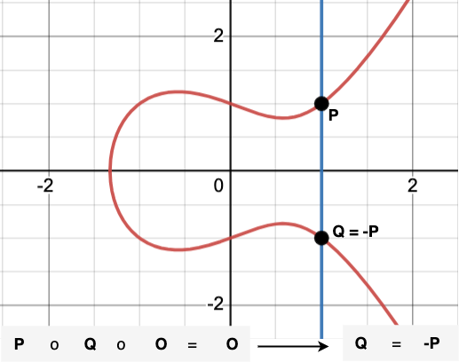

# Groups
An algebraic group is:
- a set $\mathbb{S}$ with
- a binary operation $\circ$

such that the group $(\mathbb{S}, \circ, E)$:
- is closed: $\forall_{A,B \in \mathbb{S}}, \exists_{C \in \mathbb{S}}, A \circ B = C$
- is associative: $\forall_{A,B,C \in \mathbb{S}}, (A \circ (B \circ C))=((A \circ B) \circ C)$
- has an identity element: $\forall_{A \in \mathbb{S}}, \exists_{E \in \mathbb{S}}, A \circ E = A$
- has an inverse for each element: $\forall_{A \in \mathbb{S}}, \exists_{I \in \mathbb{S}}, A \circ I = E$ meaning that $I$ is the inverse of $A$.

The group $(\mathbb{S}, \circ, E)$ is said to be finite if the number of elements of the set $\mathbb{S}$ is finite, or a number $n \ne \infty$. This number is called the order of the group and written $|\mathbb{S}|$.

## Field
A field is
- a set $\mathbb{F}$ with
- two compatible binary operations $+, \times$

and where
- $(\mathbb{F}, +)$ is a group
- $(\mathbb{F}-\\{0\\}, \times)$ is a group, where $0$ is the identity element of $(\mathbb{F}, +)$
- $+$ is commutative: $\forall_{a,b \in \mathbb{F}}, a + b = b + a$
- $\times$ is commutative: $\forall_{a,b \in \mathbb{F}}, a \times b = b \times a$
- $+, \times$ are compatible: $\forall_{a,b,c \in \mathbb{F}}, a \times (b + c) = (a \times b) + (a \times c)$

## Notational Clarification
Remark that we use capital letters $A, B, E$ to represent group elements and small letters $a, b, c$ to represent field elements. This notation will be consistently applied throughout this document.

## Modular Arithmetic
- Let $\mathbb{Z}$ denote the set of integers, $\\{-\infty\, \dots, -2,-1,0,1,2, \dots, +\infty\\}$.
- Let $n\mathbb{Z}$ denote the set of integers divisible by $n$, where $n \in \mathbb{Z}$. For example $\mathbb{_2Z}$ is the set of all even numbers.

The notation $a \equiv b \pmod n$ means both integers $a$ and $b$ have the same remainder when divided by $n$. This means $a \sim b$ (or $a$ is equivalent to $b$) when it comes to the remainder of the division by $n$.

The equivalence calss of $\overline {a}_n$ is the set of integers $\\{x \in \mathbb{Z} : a \equiv x \pmod n\\}$.

$\mathbb{Z}/n\mathbb{Z} = \\{\overline {a}_n | a \in \mathbb{Z}\\} = \\{ \overline {0}_n, \overline {1}_n, \overline {2}_n, \dots, \overline {n-1}_n\\}$ is the set of integers modulo $n$.

If $n$ is a prime number (let call it $p$), $(\mathbb{Z}/p\mathbb{Z}, +, \times)$ forms a field over the prime number $p$. We will use $\mathbb{Z_p}$ to shorten the representation of $\mathbb{Z}/p\mathbb{Z}$ in the rest of this document.

Looking deeper into the concept of a group, as modular arithmetic allows the formation of groups that are essential for the construction of cryptographically relevant hardness assumptions.

For notational simplification, we refer to the field $(\mathbb{Z}, +, \times)$ as simply $\mathbb{Z}$, and to the finite field $(\mathbb{Z}/p\mathbb{Z}, +, \times)$ as $\mathbb{Z_p}$.
## Cyclic Group
A cyclic group is a group $(\mathbb{G}, \circ, E, G)$ where each group member can be generated by applying the group operation $n$-times to a single group element $G$, $n \in (\mathbb{Z})$. This application gives each group member $N$ the representation $nG$. Recall that:
- $n$ is an element of the field $(\mathbb{Z})$ and
- $G$ is an element of the group $(\mathbb{G}, \circ, E, G)$,
- $N = nG$

For example, if $n=3$, $N = 3G =E \circ_1 G \circ_2 G \circ_3 G$.

The group element $G$ is called the generator of the group.

## Finite Cyclic Group
This is a group $(\mathbb{G}, \circ, E, G)$ on the set $\mathbb{G}=\{E, G, 2G, 3G, \dots, (p-1)G\}$, with a finite number of elements $p \in \mathbb{Z}$, where:
- $E$ is the identity element,
- $\forall_{i \in \mathbb{Z_p}, j \in {\mathbb{Z}}}, i \equiv j \pmod p \implies iG=jG$,
- $pG=0G=E$ and
- $(-1)G = (p-1)G$ is the inverse of the generator, meaning
- $(1)G \circ (-1)G = (1-1)G=0G=E$ or
- $(1)G \circ (p-1)G = (1+p-1)G=pG=E$

It turns out that $(\mathbb{G}, \circ, E, G)$ has exactly $p$ elements. The number $p$ is called the order of the generator $G$, leading to the representation $(\mathbb{G}, \circ, E, G, p)$.

## Prime Order Group
Let $(\mathbb{G}, \circ, E, G, p)$ be a group with generator $G$ of order $p$, on the binary group operation $\circ$. If $p$ is a prime number, then $(\mathbb{G}, \circ, E, G, p)$ is a prime order group.

# Elliptic-Curves (EC)
Keeping simple for the purpose of this work, [elliptic curve](https://mathworld.wolfram.com/EllipticCurve.html) are a special types of equation with the form $E(x,y) \implies y^2=x^3+ax+b$ (in the weierstrass form), whose elements known as points $(x, y)$. Enriched with a well defined points addition operation, they share some algebraic properties useful for the construction of cryptographic primitives.

## Arithmetic Elliptic-Curves
### Identity Element
There is a point $O$ on the curve so that $\forall_{P \in \mathbb{E}}, P \circ O = P$. This point is the identity element of the group. For some curves it is an imaginary point called the __Point at Infinity__.

### Elliptic-Curves Arithmetic Law (ECA)
On an elliptic-curve, a straight line can cross up to $3$ points $P, Q, R$. ECA defines the sum of those three points to be the identity element $O$, meaning $P \circ Q \circ R = O$.

### Additive Inverse
The following figure displays a line that crosses only two points $P, Q$ and is neither tangent to $P$ nor to $Q$.

ECA assumes it also crosses the identity point $O$ and defines:

$$
\begin{aligned}
Q \circ P \circ O &= O
\\
Q \circ O &= O \circ (-P)
\\
Q &= -P
\end{aligned}
$$

Therefore $-P$ is set to be the additive inverse of $P$.

In the weierstrass form, this also means the point $P=(x_P, y_P)$ is the inverse of the point $Q = -P=(x_P, -y_P)$.

### Point Addition
ECA states that the sum of $3$ points $P, Q, R$ on the same line is the identity element $O$. Meaning that $P \circ Q \circ R = O$ as displayed on the figure below.

Per consequence, the sum of any $2$ of the points $P, Q, R$ is the additive inverse of the third point.
$$
\begin{aligned}
P \circ Q \circ R &= O
\\
P \circ Q &= O \circ (-R)
\\
P \circ Q &= -R
\end{aligned}
$$

### Point Doubling
The following figure displays a straight line, tangent to the curve at point $Q$ and crossing a second point $P \ne O$.

This geometrie can be used to produce the doubling of $Q$, as ECA assumes that the line touches the curve twice at any tangent point, such that:

$$
\begin{aligned}
P \circ Q \circ Q &= O
\\
Q \circ Q &= O \circ (-P)
\\
2Q &= -P
\end{aligned}
$$

## Finite Groups over Elliptic-Curve
With the addition operation and the additive inverse defined above, the ECA allows the construction of finite groups over elements of an elliptic curve. Meaning the ECA allows the construction of the relation $\mathbb{Z_q}$ x $\mathbb{E} \implies \mathbb{E}$, where for a point $P \in \mathbb{E}$ and a number $n \in \mathbb{Z_q}$, the point $Q=nP \in \mathbb{E}$ can be generated, where $\mathbb{Z_q}$ is a finite field $(\mathbb{Z}, +, \times, q)$ of order $q$.

Therefore, from a generator point $G$, ECA allows the construction of finite cyclic groups on an elliptic curve $(\mathbb{E_{(\mathbb{Z_q})}}, \circ, O, G, p)$, where
- $\circ$ is the points addition operation defined above, including the additive inverse and the identity element at $O$,
- $G$ is the generator point,
- $p$ is the order of the group generator $G$, or the number of points on curve $\mathbb{E}$ that can be generated from $G$,
- $\mathbb{Z_q}$ is the field of integers of order $q \in \mathbb{Z}$ such that $\forall_{P=(x_P,y_P)}, \forall_{Q=nP=(x_Q, y_Q)}, x_P, y_P, n, x_Q, y_Q \in \mathbb{Z_q}$. With this, we mean not only the number of operations $n$, but also all point coordinates $x$ and $y$ have to be elements of $\mathbb{Z_q}$. This means $q$ is used to keep the computation of group elements in bounds. This also means that all relevant operations are performed modulo $q$.

Let
- $n \in \mathbb{Z_q}$ and
- $G \in \mathbb{E_{(\mathbb{Z_q})}}$, then
- $nG = P \in \mathbb{E_{(\mathbb{Z_q})}}$ stands for the $n$-times addition of the point $G$ to the identity element, or

$$nG = O \circ_{1} G \circ_{2} G \dots \circ_{n-1} G \circ_{n} G$$

The group property of elliptic-curves allows the statement like:
- $nG \circ mG = (n + m)G$ and
- $n(mG) = (n \times m)G$

The first statement $nG \circ mG = (n + m)G$ tell us that, knowing the point $nG$ and $mG$, we can compute $(n+m)G$, even without knowing or without disclosing neither $n$ nor $m$.

The second statement $n(mG) = (n \times m)G$ tells us that: knowing the scalar $n$ and the point $mG$, we can compute the point $(n \times m)G$, even without having to know $m$.

This detail level is essential for the clean understanding of resulting hardness assumptions defined below.

# EC based Hardness Assumption
## Elliptic-Curve Discrete Log Problem (ECDLP)
Working on the cyclic, finite elliptic-curve group $(\mathbb{E_{(\mathbb{Z_q})}}, \circ, O, G, p)$, and given a point $Q \in \mathbb{E}$, it is hard to find the __sufficiently large__ number $n$ such that $Q=nG$. This means it is hard to compute how many times we have to add the point $G$ to itself to get to the point $Q$.

Following integer arithmetic, we would say $G = (n^{-1}) Q = mQ$ where $m=n^{-1} \in \mathbb{Z_q}$. Recall that $n^{-1}$ is an integer number, as it is the multiplicative inverse of $n$ in $\mathbb{Z_q}$.

If $n$ is unknown, there is no easy way to find $m$ without just incrementally adding $Q$ to itself and testing the outcome. This is why it is essential to mention that $n$ has to be sufficiently large. If not, an algorithm will increment and test $Q'=n'G$, till the relation $Q'=Q$ is satisfied.

## Elliptic-curve Diffie–Hellman Assumption (ECDH)
ECDH is built on top of the ECDLP and assumes that:
- given the group $(\mathbb{E_{(\mathbb{Z_q})}}, \circ, O, G, p)$, where $O$ is the identity element, and
- given two group elements $aG$ and $bG$,
- it is hard to compute $(a \times b)G$, without knowing either $a$ or $b$.

For example:
- Alice randomly selects a number $a \in \mathbb{Z_q}$, computes and sends the group element $aG$ to Bob, and
- Bob randomly selects a number $b \in \mathbb{Z_q}$, computes and sends the group element $bG$ to Alice,
- Alice compute $S = O \circ_{1} bG, \dots, \circ_{a-1} bG \circ_{a} bG$, where $\circ_{i}$ stands for the $i^{th}$ application of $bG$ to the cumulative result,
- Bob compute $S = O \circ_{1} aG, \dots, \circ_{b-1} aG \circ_{b} aG$, where $\circ_{j}$ stands for the $j^{th}$ application of $G$ to the cumulative result,
- Alice and Bob would have applied $G$ to the initial identity element $(a \times b)$-times and will both obtain the same group element $(a \times b)G$.

For disambiguation recall that:
- $(a \times b)G = a(bG) = b(aG)$ (see above),
- $a, b \in \mathbb{Z_q}$, results to $(a \times b) \in \mathbb{Z_q}$, as $\mathbb{Z_q}$ is a field, so $(a \times b)G$ is an element of $\mathbb{E_{(\mathbb{Z_q})}}$,
- it is easy to compute $(a+b)G = aG \circ bG$, as it is simply a point addition operation.

Knowing $aG$ and $bG$, any other party will have to compute $a$ from $aG$ or $b$ from $bG$ to gain access to a computation of $a(bG) \text{ or } b(aG)$. Recall that the ability to compute $(a+b)G = aG + bG$ discloses no information on the values of $a, b \text{ or } (a \times b) \text{ or } (a + b)$.

## N-Parties ECDH
ECDH can be extended to run among $n$ parties with $n-1$ communication rounds. E.g.: $aG, bG, cG$ are sent around. Then $(a \times b)G, (b \times c)G, (a \times c)G$ are sent around. Finally all parties can compute $(a \times b \times c)G$.

# Elliptic-Curve Domain Parameter
EcDSA, EdDSA (all valiants of [DSA](https://en.wikipedia.org/wiki/Digital_Signature_Algorithm)), some other Schnorr signatures (like BIP340), are all built on top of ECDLP.

They are all based on the family of [finite cyclic elliptic-curve groups](./cha.md#finite-groups-over-elliptic-curve) $(\mathbb{E_{(\mathbb{Z_q})}}, \circ, O, G, p)$, where:
- $\mathbb{E_{(\mathbb{Z_q})}}$ represent a set of points $P=(x_P, y_P)$ on the elliptic curve $E(x,y)$,
- $\circ$ is the points addition operation, including the additive inverse and the identity element $O$ (point at infinity),
- $G$ is the generator point, meaning that all points of the group can be computed by multiplying this point by a scalar number $n \in \mathbb{Z_q}$,
- $\mathbb{Z_q}$ is the field of order $q \in \mathbb{Z}$, such that $\forall_{P=(x,y)}, \forall_{Q=nP}, x, y, n \in \mathbb{Z_q}$. This means all point coordinates and all scalar numbers used to produced group elements are element of $\mathbb{Z_q}$,
- $p$ is the order of the generator $G$, or the number of points so that $\forall_{n \in \mathbb{Z_q}}, nG \in (\mathbb{E_{(\mathbb{Z_q})}}$.

For the construction of cryptographic primitives, special secure curves have to be defined. Elliptic-curve construction distinguishes between prime case and binary case curves.

## Binary Case Elliptic-Curves
In the binary case, curves parameters for the family of elliptic-curve groups $(\mathbb{E}_{(\mathbb{F_{2^m}})}, \circ, O, G, n)$ can be defined using the notation $(m,f,a,b,G,n,h)$ where:
- $m$ is the extension of the field $\mathbb{F_{2^m}}$. E.g $\mathbb{F_{2^8}}$ or $\mathbb{F_{256}}$ is used to implement AES,
- $f$ is the auxiliary curve,
- $\mathbb{Z_{2^m}}$ is the field of order $2^m$, such that $\forall_{T=(x_T,y_T)}, \forall_{Q=nT=(x_Q, y_Q)}, x_T, y_T, n, x_Q, y_Q \in \mathbb{Z_p}$,
- $a, b$ are the parameters of the curve equation $y^2= x^3 + ax + b$ (equation written in Weierstrass form),
- $G$ is the generator point,
- $n$ is the order of the point $G$, meaning that the smallest number $k \in \mathbb{Z_{2^m}}$ such that $kG = O$.

## Prime Case Elliptic-Curves
In the prime case, the elliptic-curve group $(\mathbb{E_{(\mathbb{Z_p})}}, \circ, O, G, n)$ can be defined using the notation $(p,a,b,G,n,h)$ where:
- $p$ is a large prime and the order of the field $\mathbb{Z_p}$ (number of elements in $\mathbb{Z_p} \texttt{ or } |\mathbb{Z_p}|$),
- $\mathbb{Z_p}$ is the field of order $p \in \mathbb{Z}$, such that $\forall_{T=(x_T,y_T)}, \forall_{Q=nP=(x_Q, y_Q)}, x_T, y_T, n, x_Q, y_Q \in \mathbb{Z_p}$,
- $a, b$ are the parameters of the curve equation $y^2= x^3 + ax + b$ (equation written in Weierstrass form),
- $G$ is the generator point,
- $n$ is the order of the point $G$, meaning that the smallest number $k \in \mathbb{Z_p}$ such that $kG = O$,
- $h$ the cofactor, given $h={1 \over n}|\mathbb{E_{(\mathbb{Z_p})}}|$. $h$ is used to limit subgroup of points on which to operate, for some security reasons e.g: [Pohlig–Hellman algorithm](https://en.wikipedia.org/wiki/Pohlig%E2%80%93Hellman_algorithm) on curve25519.

## Sample Prime Case Curve secp256k1
An example is the curve used by bitcoin is secp256k1 and has following parameters:
- $p = \text{FFFFFFFF FFFFFFFF FFFFFFFF FFFFFFFF FFFFFFFF FFFFFFFF FFFFFFFE FFFFFC2F}$
- This is $2^{256} - 2^{32} - 2^9 - 2^8 - 2^7 - 2^6 - 2^4 -1$

The curve equation $E(x,y) \implies y^2= x^3 + ax + b$ over $\mathbb{Z_{2^8}}$ is defined by $y^2=x^3 + 7$, meaning:
- $\text{a = 00000000 00000000 00000000 00000000 00000000 00000000 00000000 00000000}$
- $\text{b = 00000000 00000000 00000000 00000000 00000000 00000000 00000000 00000007}$

The generator point $G$ in uncompressed form is:
- $\texttt{G = 04 79BE667E F9DCBBAC 55A06295 CE870B07 029BFCDB 2DCE28D9 59F2815B 16F81798 483ADA77 26A3C465 5DA4FBFC 0E1108A8 FD17B448 A6855419 9C47D08F FB10D4B8
}$

The generator point $G$ in compressed form is:
- $\text{G = 02 79BE667E F9DCBBAC 55A06295 CE870B07 029BFCDB 2DCE28D9 59F2815B 16F81798}$

Recall that the compressed representation of a weierstrass curve point only provides the $x$-coordinate and the indication of the sign of the $y$-coordinate $\mathtt{0x02} \text{ or } \mathtt{0x03}$ (least significant bit). As the $y$-coordinate can be computed using the curve equation $E(x,y)$.

The order $n$ of the generator $G$ is the number of points in the group $(\mathbb{E}_{(\mathbb{F_p})}, \circ, n, G)$ that can be generated from $G$, and is:
- $\text{n = FFFFFFFF FFFFFFFF FFFFFFFF FFFFFFFE BAAEDCE6 AF48A03B BFD25E8C D0364141}$

It is the smallest number $n \in \mathbb{F_{2^8}}$ such that $nG=O$.

The cofactor $h$ defines the subgroup $\mathbb{S_{r}}$ of prime order $r= { n \over h}$. Meaning for each element $kG$ of the subgroup, $k$ is a multiple of $h$. In case of secp256k1:
- $h=01$. Means all points of the group can be used.

secp256k1 is the foundation of the bitcoin EcDSA and BIP340 (Schnorr Signature).

## Sample Prime Case Curve with non Trivial Cofactor curve25519
An elliptic-curve with a non trivial cofactor is the Montgomery [curve25519](https://en.wikipedia.org/wiki/Curve25519), with following properties:
- curve equation $E(x,y) \implies y^2 = x^3 + 486662x^2 + x$. Recall that montgomery curves have the general equation $M_{A,B}: By^2 = x^3 + Ax^2 + x$ over $\mathbb{Z_p}$, where $A,B \in \mathbb{Z_p} \text{ and } B(A^2 -4) \ne 0$,
- curve25519 uses the generator point at $x=9$ and a cofactor $h=8$ to generate a cyclic group with prime order $p = 2^{252} + 27742317777372353535851937790883648493$.

Using a subgroup in this case prevents the [Pohlig–Hellman algorithm](https://en.wikipedia.org/wiki/Pohlig%E2%80%93Hellman_algorithm) attack.