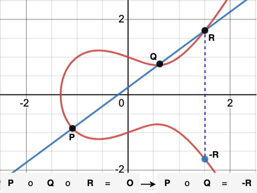
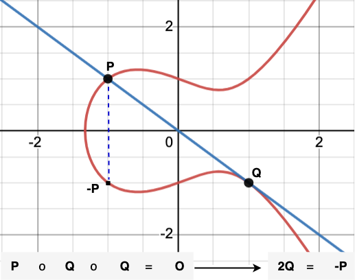

# Groups and Fields
An algebraic group is:
- a set $\mathbb{S}$ with
- a binary operation $\circ$ and
- an identity element $E$

such that the group $(\mathbb{S}, \circ, E)$:
- is closed: $\forall_{A,B \in \mathbb{S}}, \exists_{C \in \mathbb{S}}, A \circ B = C$
- is associative: $\forall_{A,B,C \in \mathbb{S}}, (A \circ (B \circ C))=((A \circ B) \circ C)$
- the identity element implies $\forall_{A \in \mathbb{S}}, A \circ E = A$
- has an inverse for each element: $\forall_{A \in \mathbb{S}}, \exists_{I \in \mathbb{S}}, A \circ I = E \text{ or } A = E \ominus I$. Remark the use of $\ominus$ to represent the inverse operation in the group.

The group $(\mathbb{S}, \circ, E)$ is said to be finite if the number of elements of the set $\mathbb{S}$ is finite, or a number $n \ne \infty$. This number is called the order of the group and written $|\mathbb{S}|$. Recall it does not matter if the number is known or not. It sufficient if the existence can be proven.

## Field
A field is
- a set $\mathbb{F}$ with
- two compatible binary operations $+, \times$

and where
- $(\mathbb{F}, +)$ is a group
- $(\mathbb{F}-\\{0\\}, \times)$ is a group, where $0$ is the identity element of $(\mathbb{F}, +)$
- $+$ is commutative: $\forall_{a,b \in \mathbb{F}}, a + b = b + a$
- $\times$ is commutative: $\forall_{a,b \in \mathbb{F}}, a \times b = b \times a$
- $+, \times$ are compatible: $\forall_{a,b,c \in \mathbb{F}}, a \times (b + c) = (a \times b) + (a \times c)$

## Notational Clarification - 1
Remark that we use capital letters $A, B, E$ to represent group elements and small letters $a, b, c$ to represent field elements. This notation will be consistently applied throughout this document.

## Modular Arithmetic
- Let $\mathbb{Z}$ denote the set of integers, $\\{-\infty\, \dots, -2,-1,0,1,2, \dots, +\infty\\}$.
- Let $n\mathbb{Z}$ denote the set of integers divisible by $n$, where $n \in \mathbb{Z}$. For example $\mathbb{_2Z}$ is the set of all even numbers.

The notation $a \equiv b \pmod n$ means both integers $a$ and $b$ have the same remainder when divided by $n$. This means $a \sim b$ (or $a$ is equivalent to $b$) when it comes to the remainder of the division by $n$.

The equivalence calss of $\overline {a}_n$ is the set of integers $\\{x \in \mathbb{Z} : a \equiv x \pmod n\\}$.

$\mathbb{Z}/n\mathbb{Z} = \\{\overline {a}_n | a \in \mathbb{Z}\\} = \\{ \overline {0}_n, \overline {1}_n, \overline {2}_n, \dots, \overline {n-1}_n\\}$ is the set of integers modulo $n$.

If $n$ is a prime number (let call it $p$), $(\mathbb{Z}/p\mathbb{Z}, +, \times)$ forms a field over the prime number $p$. We will use $\mathbb{Z_p}$ to shorten the representation of $\mathbb{Z}/p\mathbb{Z}$ in the rest of this document.

## Notational Clarification - 1

For notational simplification, we refer to the field $(\mathbb{Z}, +, \times)$ as simply $\mathbb{Z}$, and to the finite field $(\mathbb{Z}/p\mathbb{Z}, +, \times)$ as $\mathbb{Z_p}$.

## Cyclic Group
We will be looking deeper into the concept of a group, as modular arithmetic allows the formation of groups that are essential for the construction of cryptographically relevant hardness assumptions.

A cyclic group is a group $(\mathbb{G}, \circ, E, G)$ where each group member can be generated by applying the group operation $n$-times to a single group element $G$, $n \in \mathbb{Z}$. This application gives each group member $N$ the representation $nG$. Recall that:
- $n$ is an element of the field $\mathbb{Z}$ and
- $G$ is an element of the group $(\mathbb{G}, \circ, E, G)$,
- $\forall_{N \in \mathbb{G}},  \exist_{n \in \mathbb{Z}}$, such that $N= nG$

For example, if $n=3$, 

$$N = 3G =E \circ_1 G \circ_2 G \circ_3 G = E \circ \sum_{i=1}^3G = \sum_{i=1}^3G$$

As displayed above, in this document, we will use the $\sum$ symbol for the display of a series of group operations (not necessarily the addition).

The group element $G$ is called the generator of the group.

## Finite Cyclic Group
This is a group $(\mathbb{G}, \circ, E, G)$ on the set $\mathbb{G}=\set{E, G, 2G, 3G, \dots, (p-1)G}$, with a finite number of elements $p \in \mathbb{Z}$, where:
- $E$ is the identity element,
- $\forall_{i \in \mathbb{Z_p}, j \in {\mathbb{Z}}}, i \equiv j \pmod p \implies iG=jG$,
- $pG=0G=E$ and
- $(-1)G = (p-1)G$ is the inverse of the generator, meaning

$$
\begin{aligned}
&(1)G \circ (-1)G = (1-1)G=0G=E
\\
&(1)G \circ (p-1)G = (1+p-1)G=pG=E
\end{aligned}
$$

It turns out that $(\mathbb{G}, \circ, E, G)$ has exactly $p$ elements. The number $p$ is called the order of the generator $G$, leading to the representation $(\mathbb{G}, \circ, E, G, p)$.

## Prime Order Group
Let $(\mathbb{G}, \circ, E, G, p)$ be a group with generator $G$ of order $p$, on the binary group operation $\circ$. If $p$ is a prime number, then $(\mathbb{G}, \circ, E, G, p)$ is a prime order group.

# Elliptic-Curves (EC)
Keeping simple for the purpose of this work, [elliptic curve](https://mathworld.wolfram.com/EllipticCurve.html) are a special types of equation with the form $E(x,y) \implies y^2=x^3+ax+b$ (in the weierstrass form), whose elements are known as points $(x, y)$. Enriched with a well defined points addition operation, they share some properties of algebraic __groups__, useful for the construction of cryptographic primitives.

## Arithmetic of Elliptic-Curves
### Identity Element
There is a point $O$ on the curve so that $\forall_{P \in \mathbb{E}}, P \circ O = P$. This point is the identity element of the group. For some curves it is an imaginary point called the __Point at Infinity__.

### Elliptic-Curves Arithmetic Law (ECA)
On an elliptic-curve, a straight line can cross up to $3$ points $P, Q, R$. ECA defines the subsequent application of the group operation to those three points to return the identity element $O$, meaning $P \circ Q \circ R = O$.

### Additive Inverse
The following figure displays a line that crosses only two points $P, Q$ and is neither tangent to $P$ nor to $Q$.

ECA assumes it also crosses the identity point $O$ and defines:

$$
\begin{aligned}
Q \circ P \circ O &= O
\\
Q \circ O &= O \ominus P
\\
Q &= -P
\end{aligned}
$$

Therefore $-P$ is set to be the additive inverse of $P$.

In the weierstrass form, this also means the point $P=(x_P, y_P)$ is the inverse of the point $Q = -P=(x_P, -y_P)$.

### Point Addition
ECA states that the the subsequent application of the group operation on $3$ points $P, Q, R$ on the same straight line results to the identity element $O$. Meaning that $P \circ Q \circ R = O$ as displayed on the figure below.

Per consequence, the sum of any $2$ of the points $P, Q, R$ is the additive inverse of the third point.
$$
\begin{aligned}
P \circ Q \circ R &= O
\\
P \circ Q &= O \ominus R
\\
P \circ Q &= -R
\end{aligned}
$$

### Point Doubling
The following figure displays a straight line, tangent to the curve at point $Q$ and crossing a second point $P \ne O$.

This geometrie can be used to produce the doubling of $Q$, as ECA assumes that the line touches the curve twice at any tangent point, such that:

$$
\begin{aligned}
P \circ Q \circ Q &= O
\\
Q \circ Q &= O \ominus P
\\
2Q &= -P
\end{aligned}
$$

# Finite Cyclic Groups over Elliptic-Curves
With the addition operation and the additive inverse defined above, the ECA allows the construction of finite groups over elements of an elliptic curve $E(y,x): \mathbb{Z^2_q} \rightarrow \mathbb{E_{(\mathbb{Z_q})}}$. Meaning the ECA allows the construction of the mapping $\mathbb{Z_q}$ x $\mathbb{E} \implies \mathbb{E}$, where for a point $P \in \mathbb{E}$ and a number $n \in \mathbb{Z_q}$, the point $Q=nP \in \mathbb{E}$ can be generated, where $\mathbb{Z_q}$ is a finite field $(\mathbb{Z}, +, \times, q)$ of order $q$.

Therefore, from a generator point $G$, ECA allows the construction of finite cyclic groups on an elliptic curve $(\mathbb{E_{(\mathbb{Z_q})}}, \circ, O, G, p)$, where
- $\circ$ is the points addition operation defined above, including the additive inverse and the identity element at $O$,
- $G$ is the generator point,
- $p$ is the order of the group generator $G$, or the number of points on curve $\mathbb{E}$ that can be generated from $G$,
- $\mathbb{Z_q}$ is the field of integers of order $q \in \mathbb{Z}$ such that $\forall_{P=(x_P,y_P)}, \forall_{Q=nP=(x_Q, y_Q)}, x_P, y_P, n, x_Q, y_Q \in \mathbb{Z_q}$. With this, we mean not only the number of operations $n$, but also all point coordinates $x$ and $y$ have to be elements of $\mathbb{Z_q}$. This means $q$ is used to keep the computation of group elements in bounds. This also means that all relevant operations are performed modulo $q$.
- Elements of $\mathbb{Z_q}$ are integer numbers and always written using small letters, e.g.: $a, r$.
- In some cases, $\mathbb{Z_q} \equiv \mathbb{Z_{c^n}}$, where $c$ is the characteristic of the field and $n$ the degree of the field. We will keep using $\mathbb{Z_q}$ for simplicity of presentation in this document.
- $\mathbb{E_{(\mathbb{Z_q})}}$ is the set of all points computed on the curve equation $E(y,x)$ using the generator $G$.
- Elements of $\mathbb{E_{(\mathbb{Z_q})}}$ are therefore points on that curve and always written using capital letters. e.g.: $G, A, R$, where $x_R, y_R$ are integer coordinates of the point $R$. Point coordinates $x_R, y_R$ are also elements of $\mathbb{Z_q}$.

## Operations in the Field $(\mathbb{Z}, +, \times, q)$
- the expression $a + b$ denotes the addition of two integers $a, b \in \mathbb{Z_q}$. They are always performed modulo $q$ even if omitted.
- the expression $a \times b$ denotes the multiplication of two integers $a, b \in \mathbb{Z_q}$. They are always performed modulo $q$ even if omitted.

## Operations in the Group $(\mathbb{E_{(\mathbb{Z_q})}}, \circ, O, G, p)$
- $A \circ B$ denotes the addition of two points $A=(x_A, y_A) \text{ and } B=(x_B, y_B)$, both $A, B \in \mathbb{E}$. Operations on points coordinates $x_A, y_A, x_B, y_B$ are performed in $\mathbb{Z_q}$, which means modulo $q$.
- $A \ominus B$ denotes the subtraction of the point $B$ from the point $A$. It is our invention for presentation purpose. The real operation is $A \ominus B \equiv A \circ (-B)$, where $(-B)$ is the additive inverse of $B$ in the group.
- $nA$ is the $n$-times addition of the point $A$ to itself. This is called the scalar multiplication of the point $A \in \mathbb{E}$ by the integer $n \in \mathbb{Z_q}$ and display as 

$$nA= O \circ_1 A \circ_2 A \dots \circ_n A$$

- We also use the $\sum$ symbol to display the aggregated group operation 

$$\sum_{i=1}^nA = A_1 \circ A_2 \circ \dots \circ A_i \circ \dots \circ A_n$$

## Linearity of $\circ$ in $(\mathbb{E_{(\mathbb{Z_q})}}, \circ, O, G, p)$
The linearity of the group operation allows the performance of following equivalences in $\mathbb{E_{(\mathbb{Z_q})}}$:
- $nG \circ mG = (n + m)G$ and
- $n(mG) = (n \times m)G$

The first statement $nG \circ mG = (n + m)G$ tell us that, knowing the point $nG$ and $mG$, we can compute $(n+m)G$, even without knowing or without disclosing neither $n$ nor $m$.

The second statement $n(mG) = (n \times m)G$ tells us that: knowing the scalar $n$ and the point $mG$, we can compute the point $(n \times m)G$, even without having to know $m$.

This detail is essential for an effective understanding of resulting hardness assumptions defined below.

# EC based Hardness Assumptions
## Elliptic-Curve Discrete Log Problem (ECDLP)
Working on the cyclic, finite elliptic-curve group $(\mathbb{E_{(\mathbb{Z_q})}}, \circ, O, G, p)$ and given a point $Q \in \mathbb{E}$, it is hard to find the __sufficiently large__ number $n$ such that $Q=nG$. This means it is hard to compute how many times we have to apply the group operation $\circ$ to the point $G$ and itself to get to the point $Q$.

Following integer arithmetic, we would say $G = (n^{-1}) Q = mQ$ where $m=n^{-1} \in \mathbb{Z_q}$. Recall that $n^{-1}$ is an integer number, as it is the multiplicative inverse of $n$ in $\mathbb{Z_q}$.

If $n$ is unknown, there is no easy way to find $m$ without just incrementally adding $Q$ to itself and testing the outcome. This is why it is essential to mention that $n$ has to be sufficiently large. If not, an algorithm will increment and test $Q'=n'G$, till the relation $Q'=Q$ is satisfied.

## Elliptic-curve Diffie–Hellman Assumption (ECDH)
ECDH is built on top of the ECDLP and assumes that:
- given the group $(\mathbb{E_{(\mathbb{Z_q})}}, \circ, O, G, p)$, where $O$ is the identity element, and
- given two group elements $aG$ and $bG$,
- it is hard to compute $(a \times b)G$, without knowing either $a$ or $b$.

For example:
- Alice randomly selects a number $a \in \mathbb{Z_q}$, computes and sends the group element $aG$ to Bob, and
- Bob randomly selects a number $b \in \mathbb{Z_q}$, computes and sends the group element $bG$ to Alice,
- Alice compute $S = O \circ_{1} bG, \dots, \circ_{a-1} bG \circ_{a} bG$, where $\circ_{i}$ stands for the $i^{th}$ application of $bG$ to the cumulative result,
- Bob compute $S = O \circ_{1} aG, \dots, \circ_{b-1} aG \circ_{b} aG$, where $\circ_{j}$ stands for the $j^{th}$ application of $G$ to the cumulative result,
- Alice and Bob would have applied $G$ to the initial identity element $(a \times b)$-times and will both obtain the same group element $(a \times b)G$.

For disambiguation recall that:
- $(a \times b)G = a(bG) = b(aG)$ (see above),
- $a, b \in \mathbb{Z_q}$, results to $(a \times b) \in \mathbb{Z_q}$, as $\mathbb{Z_q}$ is a field, so $(a \times b)G$ is an element of $\mathbb{E_{(\mathbb{Z_q})}}$,
- it is easy to compute $(a+b)G = aG \circ bG$, as it is simply a point addition operation.

Knowing $aG$ and $bG$, any other party will have to compute $a$ from $aG$ or $b$ from $bG$ to gain access to a computation of $a(bG) \text{ or } b(aG)$. Recall that the ability to compute $(a+b)G = aG \circ bG$ discloses no information on the values of $a, b \text{ or } (a \times b) \text{ or } (a + b)$.

## N-Parties ECDH
ECDH can be extended to run among $n$ parties with $n-1$ communication rounds. E.g.: $aG, bG, cG$ are sent around. Then $(a \times b)G, (b \times c)G, (a \times c)G$ are sent around. Finally all parties can compute $(a \times b \times c)G$.

# Next
Proceed with [Threshold signature scheme (TSS) on ECDSA](./mpc/ecdsa-tss.md).
